# Impact Evaluation

## Executive Summary
This project leveraged the Reality Check (RC) data to analyse how different concerns and attitudes, such as long-term optimism, influence different consumer mindsets in the current socio-economic climate. By identifying key drivers for mindsets like "Confident" and "Resentful," the analysis offers actionable insights that can improve targeted marketing strategies for clients. The potential impact on client revenue is significant, with estimated gains of up to £20 million across 20 clients. While the study faced limitations such as class imbalance, it provides a strong foundation for future, more sophisticated analyses.

## Introduction
The RC data began as a COVID-19 tracker in March 2020. However, by 2023, it had evolved into a UK-wide segmentation survey that groups people based on their resilience levels and how the cost-of-living crisis has impacted their attitudes and behaviours. The sharp rise in inflation in 2022 triggered this crisis, leading to significant shifts in spending habits, with 86% of UK adults expressing concern about their daily living costs.(1,2) The RC survey consists of six mindsets or segments: Surviving, Frustrated, Resentful, Coping, Carefree and Confident. Currently, RC is a quarterly tracker, and this project focuses on data from Q2 2024. An earlier analysis of the Q3 2023 RC data did not explore these mindsets in detail. This project aims to build upon the previous work by delving deeper into the mindsets and the factors that drive them. By gaining a clearer understanding of these segments, the media agency can better assist clients in refining their marketing strategies and improving business key performance indicators (KPIs).

## Methodology
### Hypothesis
H0: There is no statistically significant relationship between different mindsets and various concerns and attitudes.
H1: There is at least one statistically significant relationship between mindsets and various concerns and attitudes.
In this context, the concerns and attitudes refer to a wide range factors, such as long-term optimism, worries about economic conditions, personal and financial wellbeing, social issues, and more specific anxieties (e.g., artificial intelligence).

### Data Workflow
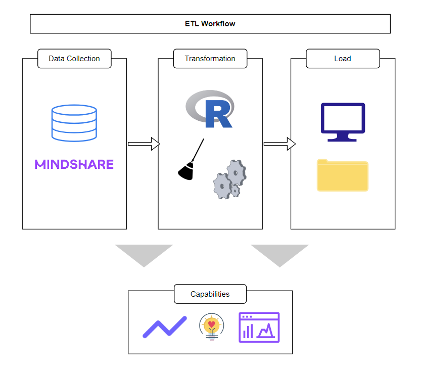

Figure 1. Diagram of the ETL pipeline. Capabilities include analytics and insights. 

The project demonstrates key ETL concepts, emphasising the importance of efficient data sourcing, extraction, transformation and loading. Streamlining this via R scripts ensure accurate data, which is crucial for achieving success in analysis and media planning for clients.

### Data Preparation and Analysis
The analysis began with a thorough preparation process, ensuring the dataset was clean, consistent, and suitable for logistic regression modelling. The most recent dataset, Q2 2024, was selected for analysis. To maintain data quality, duplicate columns were removed, missing values were handled, and variables were appropriately coded. Continuous variables with fewer than 100 missing values were retained, resulting in 56 predictors. This careful selection ensured a manageable predictor-to-target ratio (10 to 1), enhancing the model's stability and accuracy.(3)

Following data preparation, exploratory data analysis (EDA) was conducted to identify potential issues, such as class imbalance (see Figures 2 and 3). While class imbalance was present in most datasets, it was not addressed due to project simplicity and time constraints. Multicollinearity, a critical element of modelling, was assessed, and variables with high variance inflation factors (VIFs) were removed from the dataset.(4)

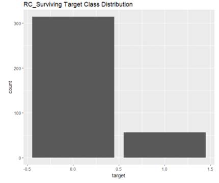

Figure 2. Target Class Distribution in the Surviving Segment. This chart shows that there is a class imbalance.

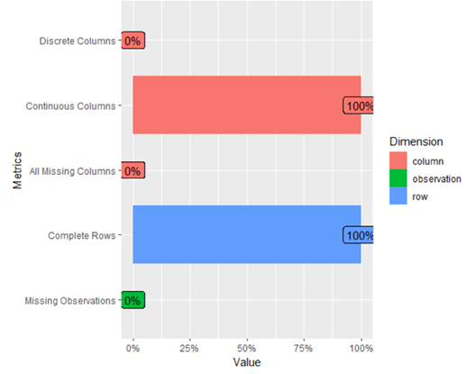

Figure 3. Data Profile of the Surviving Segment. This was created using the DataExplorer R package. There are no missing data, as expected.

Logistic regression was chosen over linear regression due to its suitability for classification problems and ability to handle both binary and continuous variables.(5) Separate logistic regression models were built for each mindset segment, with the dependent variable indicating segment membership. Independent variables included selected predictors, such as concerns about housing prices and the economy. 

Model evaluation involved generating predictions, creating ROC curves to determine optimal thresholds, and analysing confusion matrices to assess model performance. Performance metrics such as accuracy, precision, recall, and F1 scores were calculated for each model. This approach enables toe capture of nuanced differences between mindsets and provides probabilistic predictions for each respondent’s likelihood of belonging to a mindset.

Ethical considerations and data privacy concerns were upheld in this analysis. The survey data did not contain any personally identifiable information (PII), ensuring that the respondents’ identities remained confidential. Each observation was anonymised and represented by a unique identifier, safeguarding user privacy. This aligns with best practices within both the Data Protection Act (DPA) 2018 and General Data Protection Regulation (GDPR).(6,7)

## Results
The analysis provided valuable insights into factors influencing each mindset. Key drivers were identified for most segments, as illustrated in Figures 4 to 9, apart from the Frustrated segment, which presented a unique case with only a single significant predictor showing an odds ratio of less than 1. For instance, Figure 4 demonstrates that long-term optimism is the strongest predictor of belonging in the Confident segment. Those with higher long-term optimism are 3.5 times more likely to be classified as “Confident” compared to those with lower levels of long-term optimism. This suggests that optimism plays a crucial role in shaping a confident mindset.

Conversely, Figure 7 reveals that concern about job security or unemployment increases the likelihood of being in the Resentful group by 1.5 times. This indicates that heightened worries about job stability are significantly associated with a more resentful outlook.

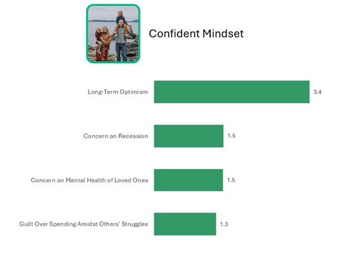

Figure 4. Driving factors in the Confident Segment. The numbers represent odds ratios.

Figure 5. Driving factors in the Carefree Segment. The numbers represent odds ratios.

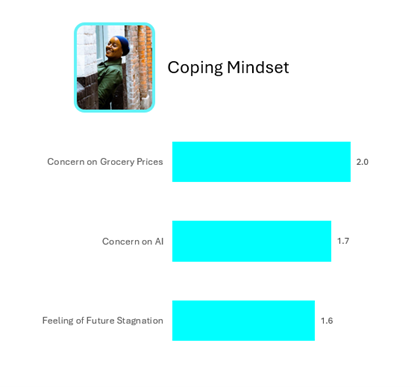

Figure 6. Driving factors in the Coping Segment. The numbers represent odds ratios.

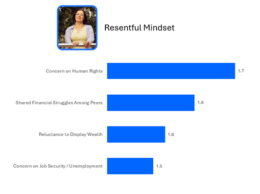

Figure 7. Driving factors in the Resentful Segment. The numbers represent odds ratios.

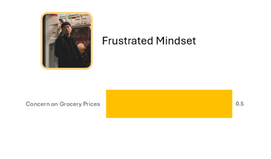

Figure 8. Driving factors in the Frustrated Segment. The numbers represent odds ratios.

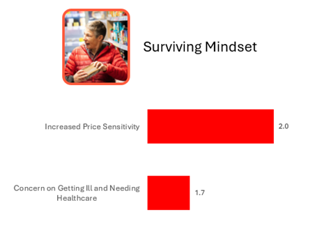

Figure 9. Driving factors in the Surviving Segment. The numbers represent odds ratios.

Figure 10 highlights common features across the models, indicating their importance in influencing the mindsets. These findings can be applied to create recommendations and media implications for our clients (see Figure 11).

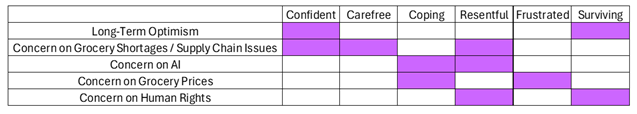

Figure 10. Common Driving Factors across Models. 

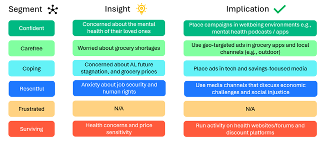

Figure 11. Media Planning Implications for each Segment.

Upon model evaluation, the overall performance was consistently strong. For example, in the Surviving segment model, the ROC curve (see Figure 12) was used to determine the optimal threshold of 0.35, defined as the upper-left corner of the curve.(8) This threshold was then applied to generate the confusion matrix (see Figure 13), which in turn calculated the model’s accuracy, precision, recall and F1 score (see Figure 14). Specifically, the Surviving segment model demonstrated a high precision score of 0.96, indicating the model’s accuracy in predicting membership within this segment. Additionally, a recall score of 0.88 suggests that the model rarely misses true positives. The F1 score, which combines precision and recall, further reflects the model’s balanced and robust performance.

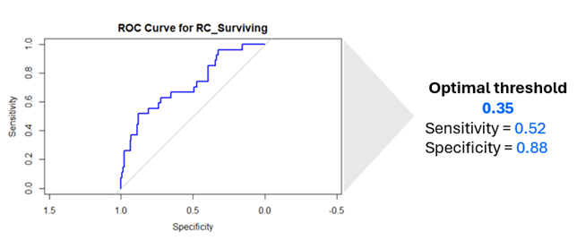

Figure 12. ROC curve of the Surviving Segment. Sensitivity and Specificity is specified to show where the optimal threshold lies.

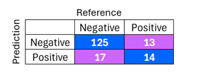

Figure 13. Confusion Matrix of the Surviving Segment. 

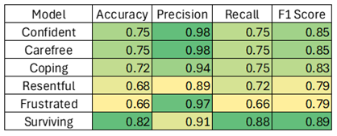

Figure 14. Model Evaluation Metrics for each Segment.

## Value Estimation
The insights from this analysis could significantly boost client sales and revenue. Using Fermi Estimation, if targeted campaigns increase conversion rates by 2% over one year, a client with £50 million in annual media-driven revenue could gain an additional £1 million in revenue.(9) Across 20 clients, this could potentially generate £20 million in added revenue.

The estimated cost of the project, including 60 hours for data collection, processing, analysis and reporting at an hourly rate of £20, sums up to £1,200. Given these projections, the potential return on investment (ROI) would highly outweigh the costs, making this analysis highly valuable for driving business metrics for clients.

## Limitations and Future Considerations
The analysis provided valuable insights into the factors of different mindsets; however, several limitations should be considered. A key limitation was the decision not to address class imbalance using oversampling methods such as Synthetic Minority Over-sampling Technique (SMOTE). Class imbalance can lead to models that overpredict the majority class, reducing accuracy for the minority class and impacting the overall effectiveness of the analysis.(10)

Another limitation is the nature of survey data, which can lead to non-response and recall biases. Non-response bias can result in data that does not accurately reflect the real world while recall bias can result in inaccurate data as respondents may rely on memory, which can be flawed.(11,12) 

For future iterations, class imbalance should be addressed using techniques like SMOTE to enhance model performance. Additionally, exploring advanced machine learning models such as random forests or gradient boosting could offer more sophisticated insights by better handling complex interactions between variables.(13)

Finally, future work should adopt methods to mitigate non-response bias, such as using weighting techniques, to ensure the survey data more accurately represents the general population, leading to more reliable and actionable insights.

## Conclusion
This project aimed to understand how various concerns and attitudes, such as long-term optimism, predict an individual’s likelihood of adopting a specific mindset in the current socio-economic climate. The analysis provided valuable insights into the key drivers behind different segments, offering actionable implications that could significantly refine targeted marketing strategies. By identifying factors that influence these mindsets, media campaigns can be more effectively tailored, potentially leading to increased client revenue. While the analysis had its limitations like class imbalance, the findings lay the groundwork for more advanced future analyses that can further boost client outcomes.

## References
1.	[UK Consumers and The Cost of Living Market Report](https://store.mintel.com/report/uk-consumers-and-the-cost-of-living-market-report)
2.	[How The Cost of Living Crisis is Changing People's Behaviours](https://www.pwc.co.uk/services/risk/rethink-risk/insights/how-the-cost-of-living-crisis-is-changing-people-s-behaviours-an.html)
3.	[Ref3](https://www.ncbi.nlm.nih.gov/pmc/articles/PMC7032893/)
4.	[Removing Multi Collinearity for Linear and Logistic Regression](https://medium.com/analytics-vidhya/removing-multi-collinearity-for-linear-and-logistic-regression-f1fa744f3666)
5.	[A Basic Guide to Logistic Regression](https://godatadrive.com/blog/a-basic-guide-to-logistic-regression)
6.	[Personal Data](https://gdpr-info.eu/issues/personal-data/)
7.	[Data Protection](https://www.gov.uk/data-protection)
8.	[Classification Threshold](https://www.iguazio.com/glossary/classification-threshold/)
9.	BPP University. Level 6 BSc Data Science. Data Science Professional Practice Module. Horizon Scanning Lecture Slides.
10.	[How to Deal with Imabalanced Classification and Regression Data](https://neptune.ai/blog/how-to-deal-with-imbalanced-classification-and-regression-data)
11.	[Nonresponse Bias Explained](https://www.scribbr.co.uk/bias-in-research/nonresponse-bias-explained/)
12.	[What is Recall Bias?](https://www.scribbr.co.uk/bias-in-research/what-is-recall-bias/)
13.	[The Battle Between Logistic Regrssion Random Forest Classifier XG Boost and Support Vector](https://medium.com/@nischitasadananda/the-battle-between-logistic-regression-random-forest-classifier-xg-boost-and-support-vector-46d773c70f41)
